This article walks through a scroll app built from the public 10x Genomics
dataset of CD8+ T cells from four donors (gene expression, TCR and antigen
binding; 237,883 cells). Everything shown comes from one call to
`scroll_build()`; the repertoire panels appear because the build was given a
`vdj_spec()`.

## The page

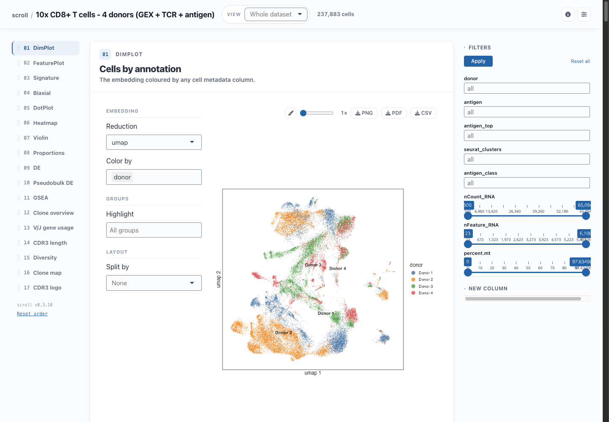

- **App bar** (top): the dataset title, the **View** selector, the number of
  cells currently shown, dataset details, a two-panels-per-row toggle and the
  control-rail toggle.
- **Panel rail** (left): one entry per panel. Click to jump; drag to reorder.
- **Panels** (centre): each card has *what to plot* on the left and the plot on
  the right, with a toolbar for the Style sheet, export size, and PNG / PDF /
  CSV downloads.
- **Control rail** (right): filters that narrow every panel at once, and the
  *New column* tool.

Panels only draw while they are on screen, and only show up when the data
supports them (DE needs a grouping column, the repertoire panels need TCR data).
The `panels:` and `exclude_panels:` keys in `config.yaml` override this.

## Looking at cells

**DimPlot** colours any embedding by a metadata column, with optional
highlighting of chosen groups and a split into facets.

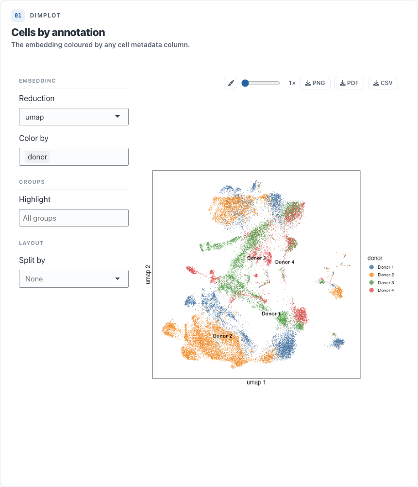

**FeaturePlot** takes several genes (or numeric columns) at once and draws a
grid, each with its own colour scale. With two genes, *Blend* shows
co-expression.

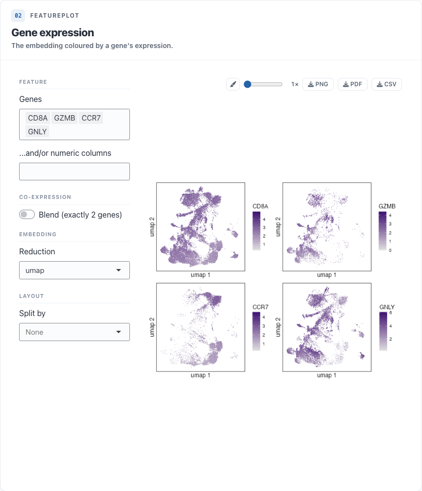

**Signature** scores a gene list per cell: a plain mean, a z-score,
Seurat's `AddModuleScore` (matched exactly), UCell or an AUCell-style score. The
score can be shown on the embedding or as a violin, and *Add as column* makes
it (and optional high / low groups) a column in every other panel.

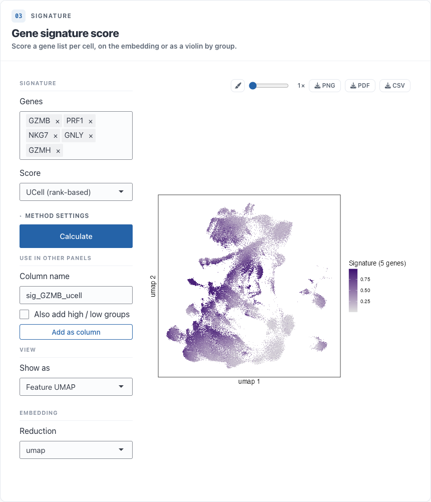

**Biaxial** plots pairs of numeric columns against each other, e.g. QC metrics
or antibody-derived tags.

## Comparing groups

**DotPlot** shows the fraction of cells expressing each gene and the mean
expression per group, with optional clustering and dendrograms. **Heatmap**,
**Violin** and **Ridge** show the same genes as a heatmap, as violins or as one
density ridge per group. The DotPlot and Violin gene boxes accept a pasted list.

These panels can group by several columns at once (e.g. cluster and donor), and
list groups in natural order, so cluster 2 comes before cluster 10. To set your
own order, drag the group labels in the plot's Style sheet.

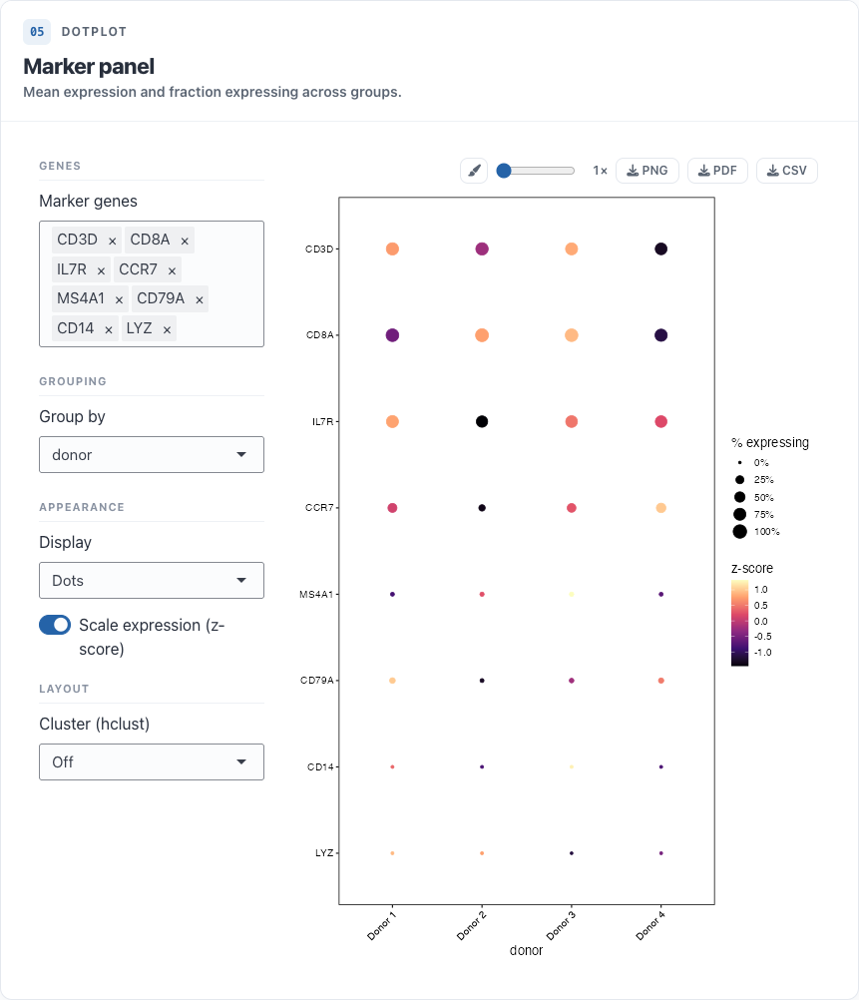

**Proportions** shows how one grouping is made up of another, e.g. each
cluster's donor composition.

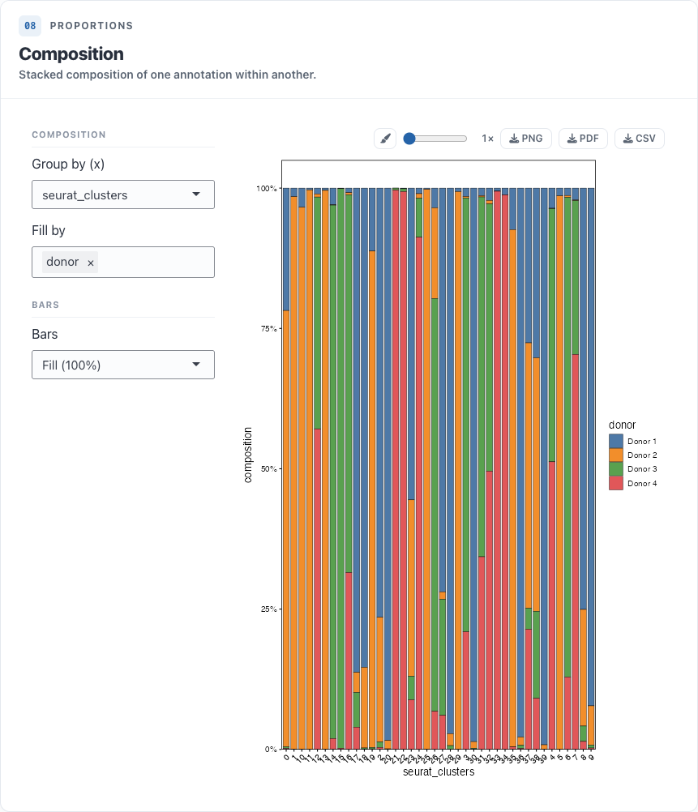

## Differential expression

**DE** runs a Wilcoxon test (presto) for any contrast: one or more groups
against another set or against the rest. The result appears as a table and a
volcano plot. The CSV can hold the rows on screen, only the genes passing the
cutoffs, or every gene.

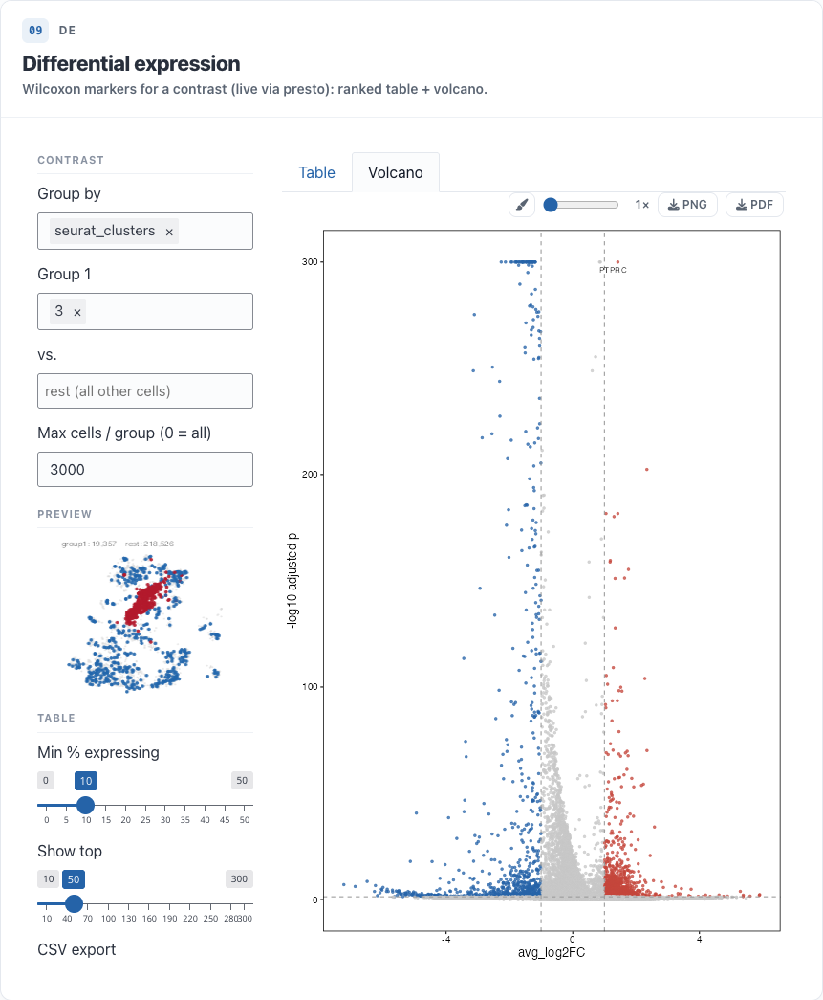

**Pseudobulk DE** sums counts per sample and tests with edgeR / limma-voom,
using replicates (e.g. donors) when you name them and pseudo-replicates when
you don't. It needs a project built with `counts = TRUE`.

**GSEA** takes the latest DE or Pseudobulk result and runs preranked GSEA
(fgsea) against gene sets saved in the project (`scroll_add_genesets()`) or
fetched from MSigDB. It shows a table, the top pathways, and the running
enrichment score for any pathway.

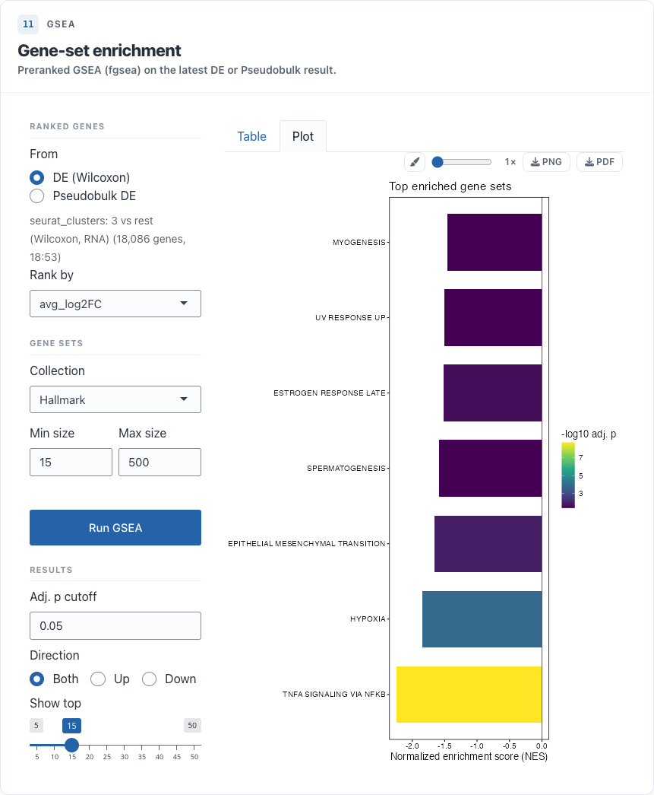

## Immune repertoire, spatial and ATAC

Projects built with `vdj_spec()` get six repertoire panels: clone overview
(rank-abundance and expansion), V/J gene usage, CDR3 length, diversity, a clone
map on the embedding and a CDR3 sequence logo. `spatial_spec()` adds a tissue-image panel and
`atac_spec()` a peak panel.

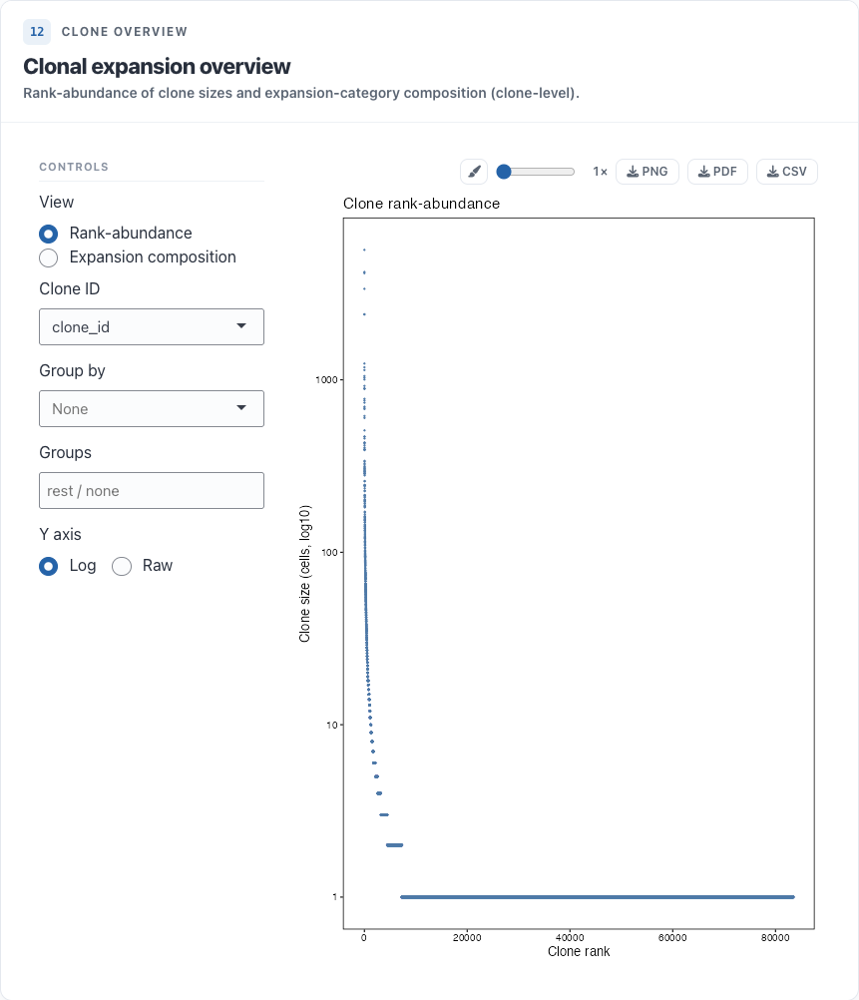

## Styling a plot

The paintbrush in a plot's toolbar opens its **Style sheet**. Changes apply
live: palettes and point sizes, titles and axis labels, the theme (fonts,
legend, gridlines), axis ranges and scales, and the fixed settings of every
layer the plot draws. *Apply theme to all plots* copies one plot's theme to the
rest, and **Save** writes every plot's style to `style.yaml` in the project so
the next session starts from it.

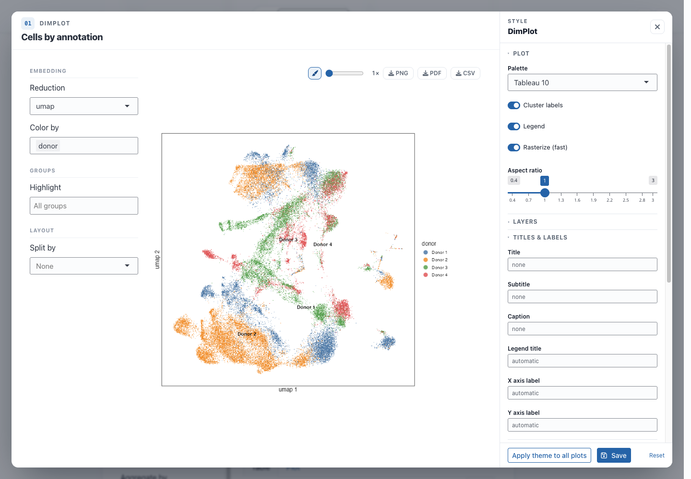

## Views, filters and new columns

A project built with subset views (`scroll_add_subset()`) gets a **View**
selector in the app bar. Choosing a view restricts every panel to that subset
and switches the scatter plots to its own embedding; here, one donor
re-embedded on its own.

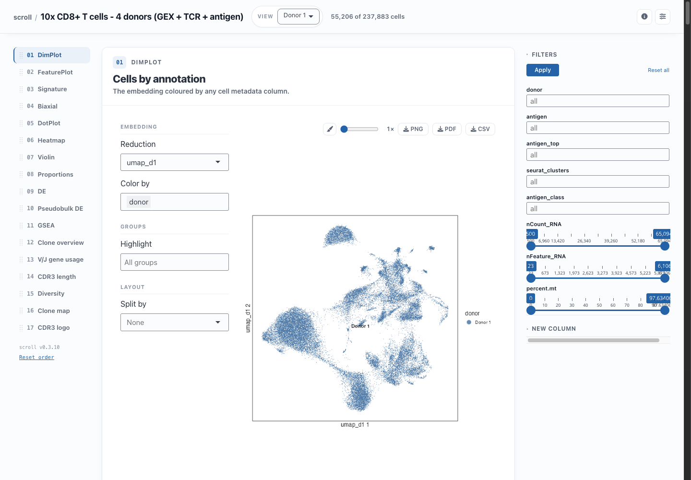

The control rail on the right holds **Filters**, which narrow every panel to
the chosen levels or ranges when you click *Apply*, and **New column**, which
maps the levels of a column to new labels for the session. For example,
`[Donor 1, Donor 2]: A, [Donor 3, Donor 4]: B` adds a `batch` column that every
panel can colour, group or split by.

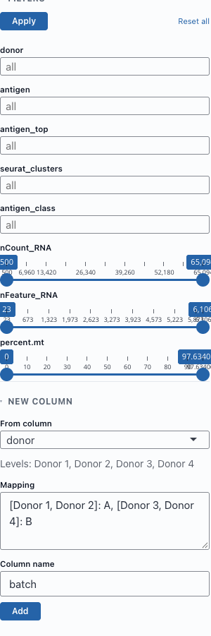

## Next steps

- [Getting started](getting-started.html): build and configure a project.
- [Custom panel](custom-panel-neighbours.html): add a panel of your own.
