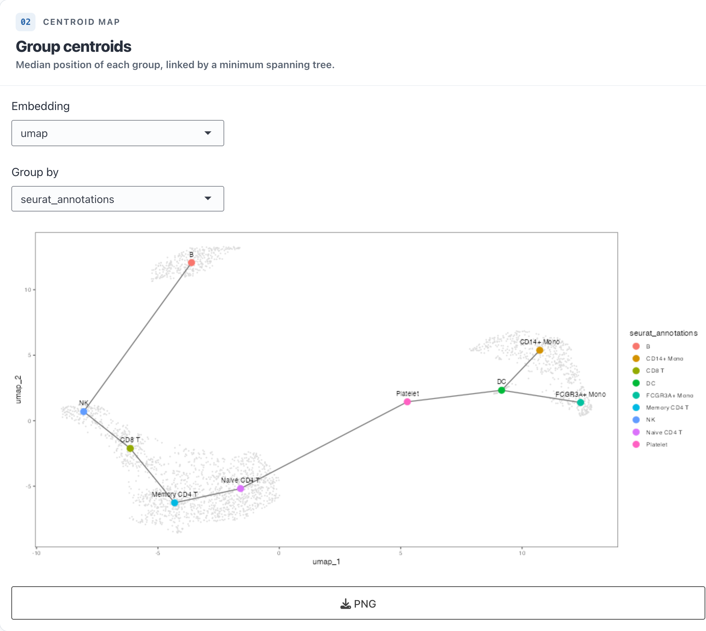

```{r, include = FALSE}
knitr::opts_chunk$set(collapse = TRUE, comment = "#>", fig.width = 6, fig.height = 5)
```

`scroll`'s panel list is an extension point. This vignette builds a working
example — a **Centroid map** that plots the median position of each cell group in
an embedding and links the group centroids with a minimum spanning tree — two ways:

* **`register_plot_panel()`** — declarative. You write only a *plot function* and a
  list of *declared controls*; scroll generates the whole Shiny module (UI, control
  population, a Compute gate, error messages, PNG/PDF export, spinner, and app-bar
  subset/view awareness). Start here.
* **`register_panel()`** — the low-level module contract the built-ins use. Reach
  for it when a panel needs cross-output state or custom reactivity the builder
  doesn't cover.

## The quick way — `register_plot_panel()`

Write the analysis as a plain function of a cell data frame (Step 1 below), then
register it with a one-line control declaration. This complete panel adds a
**Group by** dropdown of categorical columns and draws the centroid map:

```{r quickway, eval = FALSE}
library(scroll)
# centroid_map() is the plain function defined in Step 1
register_plot_panel("centroids",
  label = "Centroid map", title = "Group centroids", after = "dimplot",
  compute = FALSE,                                   # live: redraw on any change
  controls = list(
    scroll_input_column("group", "Group by", "categorical")),
  plot = function(cells, input, data) {
    emb <- data$manifest$default_embedding
    centroid_map(cells, group_by = input$group,
                 x = paste0(emb, "_1"), y = paste0(emb, "_2"))
  })

scroll_serve("pbmc3k")            # the panel appears after DimPlot
```

That's the whole panel — no `moduleServer`, no `renderPlot`, no download handlers.
`plot = function(cells, input, data)` receives the **active** (subset/view-filtered)
cells, the control values by id (`input$group`), and the data handle. An empty
required control or an error in the plot function shows an inline message instead of
a blank plot.

### Previewing while you develop

While iterating, `scroll_preview_panel()` mounts just **that** panel in the real app
harness (app bar + subset filter + subset-View selector, no other panels), so you get
quick feedback without building or scrolling through the whole app — and the panel is
exercised exactly as it will run:

```r
source("panels/my_panel.R")               # (re-)registers the panel
scroll_preview_panel("my_panel", "pbmc3k")
# edit the panel file -> re-source -> re-run
```

**Declared controls** (`controls = list(...)`):

| Constructor | Input |
|-------------|-------|
| `scroll_input_column(id, label, type, view_aware=)` | pick a metadata column (`"categorical"`/`"numeric"`/`"any"`) |
| `scroll_input_levels(id, label, from, required=, none=)` | selectize of the levels of the column chosen by control `from` |
| `scroll_input_gene(id, label, multiple=)` | server-side gene search over the default assay |
| `scroll_input_assay(id, label)` | pick an assay (auto-hidden on single-assay data) |
| `scroll_input_embedding(id, label, view_aware=)` | pick a reduction (narrows to the active subset view) |
| `scroll_input_custom(id, label, ui, bind=)` | your own control — supply a `ui(ns, data)` (+ optional `bind`) |
| `scroll_input_numeric` / `_slider` / `_choice` / `_text` | the matching Shiny inputs |

`compute = TRUE` (the default) gates redraws behind a **Compute** button — use it
when the plot is expensive (e.g. runs `scroll_de()`); `compute = FALSE` redraws live.
A worked, real-world builder panel — a two-contrast concordance scatter — ships at
`examples/concordance-panel.R`.

### Richer controls

Beyond the basics, three patterns cover most "a variety of options" needs — all
still declarative, no `moduleServer`:

**Assay + embedding pickers** read straight from the manifest.
`scroll_input_assay()` renders nothing on a single-assay dataset (its value still
resolves to the default assay), and `scroll_input_embedding()` follows the app-bar
**View**: switch to a subset view and it lists that view's sub-embedding.

```{r rich-assay, eval = FALSE}
register_plot_panel("expr_scatter", label = "Expression scatter", compute = FALSE,
  controls = list(
    scroll_input_assay("assay"),
    scroll_input_embedding("emb"),
    scroll_input_gene("gene", "Gene", required = TRUE)),
  plot = function(cells, input, data) {
    v <- data$query1(input$assay, input$gene)               # dequantized (cell, value)
    cells$expr <- v$value[match(cells$cell, v$cell)]; cells$expr[is.na(cells$expr)] <- 0
    ggplot2::ggplot(cells, ggplot2::aes(.data[[paste0(input$emb, "_1")]],
                                        .data[[paste0(input$emb, "_2")]], colour = expr)) +
      scroll_point_layer(raster = nrow(cells) > 2e4) +       # fast on screen, vector on export
      scroll_continuous_scale("viridis", name = input$gene)  # matches FeaturePlot
  })
```

**Conditional controls** — wrap any control in `scroll_show_when()` so it appears
only when another control has a given value (client-side, no redraw):

```{r rich-conditional, eval = FALSE}
controls = list(
  scroll_input_choice("engine", "Engine", c("Wilcoxon", "Pseudobulk")),
  scroll_show_when(                                          # only for Pseudobulk
    scroll_input_column("rep", "Replicate", "categorical"),
    control = "engine", equals = "Pseudobulk"))
```

**Your own control kind** — `scroll_input_custom()` takes a `ui(ns, data)` (and an
optional `bind(input, session, data)` for server-side wiring), so a bespoke widget
composes with the declared ones and reaches `plot` as `input$<id>` like any other.

**Data-derived choices** — when a control's options come from a *baked asset* or the
data rather than the manifest, pass a function. `scroll_input_choice(choices =
function(data))` computes its list at render time, and `scroll_input_levels(choices =
function(input, data), watch = c(...))` recomputes its levels whenever a watched
control changes — letting one control cascade off another over your own data:

```{r dynamic-choices, eval = FALSE}
controls = list(
  # options discovered from a file the build wrote next to the project
  scroll_input_choice("subset", "Subset",
    choices = function(data) tools::file_path_sans_ext(
      list.files(file.path(data$dir, "subsets"), pattern = "\\.rds$"))),
  # levels recomputed from the chosen subset's baked table
  scroll_input_levels("groups", "Groups", none = TRUE, watch = "subset",
    choices = function(input, data) {
      d <- readRDS(file.path(data$dir, "subsets", paste0(input$subset, ".rds")))
      unique(d$group)
    }),
  scroll_input_column("call", "Antigen call", prefer = c("antigen_call", "antigen")),
  scroll_input_palette("pal", "Palette", "continuous"))
```

**Reusable look & feel.** So a custom plot matches the built-ins, the same helpers
they use are exported: `scroll_point_layer()` (rasterizes large scatters on screen,
stays vector on export), `scroll_discrete_colors()` / `scroll_continuous_scale()`
(the shared palettes — a level keeps its colour across panels), and
`scroll_group_labels(df, group, x, y)` (per-group centroid labels).

## The panel contract (advanced)

When you need full control, `register_panel()` takes the same pair the built-ins
use:

A panel is a pair of functions:

* **`ui(id, data)`** returns a UI tag. Namespace every input/output with
  `shiny::NS(id)`.
* **`server(id, data, cells_r)`** wires the module, usually via
  `shiny::moduleServer()`. Use **`cells_r()`**, not `data$cells`, so the panel
  honours the app-bar view / subset filters.

Both receive the shared **`data`** handle:

| Field | What it is |
|-------|------------|
| `data$cells` | one row per cell: `cell` id, every exported metadata column, and embedding coordinates named `<reduction>_1`, `<reduction>_2` |
| `data$manifest` | the parsed `manifest.yaml` — assays, `embeddings`, `meta` (per-column `type`/`levels`/`range`), `default_embedding`, … |
| `data$config` | the parsed `config.yaml`, or `NULL` |
| `data$query1(assay, feature)` | one gene's expression, as `data.frame(cell, value)` (dequantized; zero cells omitted) |
| `data$queryN(assay, features)` | many genes at once, as `data.frame(feature, cell, value)` |

Rather than parse the manifest by hand, three exported accessors give you what
controls need (each takes an optional `view` / `assay` to respect subset views):

```{r manifest-lookups, eval = FALSE}
scroll_columns(data, "categorical")     # metadata columns of a type ("numeric"/"any")
scroll_columns(data, "categorical", view = "tcell")   # scoped to a subset view
scroll_embeddings(data)                 # reduction names (or of a subset view)
scroll_features(data, "RNA")            # an assay's features (default assay if omitted)

# the raw manifest is still there if you need a level list or a numeric range:
data$manifest$meta$celltype$levels      # a categorical column's levels
data$manifest$meta$percent.mt$range     # a numeric column's c(min, max)
```

`data$query1(assay, feature)` returns a **sparse** `data.frame(cell, value)` (cells
with zero expression are omitted) in **dequantized** units — join it back onto
`cells` and fill missing with 0, as in the Expression scatter above.

## Step 1 — the plot, as a plain function

Keep the analysis in a standalone function that takes a data frame and returns a
`ggplot`. It's easier to test and reuse than logic buried in a reactive. This one
computes a per-group **median centroid**, links the centroids with a **minimum
spanning tree** (a small base-R Prim's algorithm — no extra packages), and draws
the cells faintly underneath.

```{r plot-fn}
library(ggplot2)

# Minimum spanning tree over 2-D points, returned as (from, to) index pairs.
mst_edges <- function(x, y) {
  n <- length(x)
  if (n < 2) return(data.frame(from = integer(0), to = integer(0)))
  d <- as.matrix(stats::dist(cbind(x, y)))
  in_tree <- c(TRUE, rep(FALSE, n - 1))
  from <- to <- integer(n - 1)
  for (k in seq_len(n - 1)) {                 # Prim's: cheapest edge tree -> rest
    cand <- d[in_tree, !in_tree, drop = FALSE]
    ij <- which(cand == min(cand), arr.ind = TRUE)[1, ]
    i <- which(in_tree)[ij[1]]; j <- which(!in_tree)[ij[2]]
    from[k] <- i; to[k] <- j
    in_tree[j] <- TRUE
  }
  data.frame(from = from, to = to)
}

# cells: a data.frame with the two coordinate columns + a grouping column.
centroid_map <- function(cells, group_by, x = "umap_1", y = "umap_2") {
  cells <- cells[!is.na(cells[[x]]) & !is.na(cells[[y]]), , drop = FALSE]
  g <- as.character(cells[[group_by]])
  cent <- stats::aggregate(cells[, c(x, y)], list(group = g), stats::median)
  names(cent) <- c("group", "cx", "cy")

  e <- mst_edges(cent$cx, cent$cy)
  seg <- data.frame(x = cent$cx[e$from], y = cent$cy[e$from],
                    xend = cent$cx[e$to], yend = cent$cy[e$to])

  ggplot() +
    geom_point(data = cells, aes(.data[[x]], .data[[y]]),
               colour = "grey85", size = 0.4) +
    geom_segment(data = seg, aes(x, y, xend = xend, yend = yend),
                 linewidth = 0.6, colour = "grey40") +
    geom_point(data = cent, aes(cx, cy, colour = group), size = 4) +
    geom_text(data = cent, aes(cx, cy, label = group), vjust = -1.2, size = 3.3,
              show.legend = FALSE) +
    labs(x = x, y = y, colour = group_by) +
    theme_bw() + theme(panel.grid = element_blank())
}
```

Try it on a small synthetic embedding (five Gaussian blobs) — this is exactly the
shape of `data$cells`:

```{r plot-demo, fig.alt = "Five Gaussian cell-type blobs in a 2-D embedding, each group's median centroid marked and labelled, with the centroids linked by a minimum spanning tree."}
set.seed(1)
blob <- function(g, mx, my, n = 200)
  data.frame(cell = paste0(g, seq_len(n)),
             umap_1 = rnorm(n, mx), umap_2 = rnorm(n, my), celltype = g)
cells <- rbind(blob("Tfh", 0, 0), blob("CD8", 4, 1), blob("Treg", 1, 4),
               blob("B", -3, 3), blob("NK", -4, -2))

centroid_map(cells, group_by = "celltype")
```

## Step 2 — wrap it as a panel

The UI offers an embedding and a group-by control (both read from the manifest);
the server reads the chosen `<reduction>_1/_2` columns off `cells_r()` and calls
`centroid_map()`.

```{r panel, eval = FALSE}
centroid_ui <- function(id, data) {
  ns <- shiny::NS(id)
  reductions <- names(data$manifest$embeddings)
  cats <- names(Filter(function(x) identical(x$type, "categorical"),
                       data$manifest$meta))
  shiny::tagList(
    shiny::selectInput(ns("reduction"), "Embedding", reductions,
                       selected = data$manifest$default_embedding),
    shiny::selectInput(ns("group"), "Group by", cats),
    shiny::plotOutput(ns("plot"), height = "480px"),
    shiny::downloadButton(ns("png"), "PNG")
  )
}

centroid_server <- function(id, data, cells_r = shiny::reactive(data$cells)) {
  shiny::moduleServer(id, function(input, output, session) {
    plot_r <- shiny::reactive({
      shiny::req(input$reduction, input$group)
      centroid_map(cells_r(), group_by = input$group,       # cells_r(), not data$cells
                   x = paste0(input$reduction, "_1"),
                   y = paste0(input$reduction, "_2"))
    })
    output$plot <- shiny::renderPlot(plot_r())
    output$png <- shiny::downloadHandler(
      filename = function() "centroids.png",
      content  = function(file) ggplot2::ggsave(file, plot_r(), width = 7, height = 6))
  })
}
```

## Step 3 — register and serve

Register the panel *before* `scroll_app()`/`scroll_serve()`. `after = "dimplot"`
places it right after the DimPlot panel (use `before =` or an existing `id` to
replace a built-in; omit both to append).

```{r register, eval = FALSE}
library(scroll)
# ... define centroid_map / mst_edges / centroid_ui / centroid_server ...

register_panel("centroids", centroid_ui, centroid_server,
               label = "Centroid map", title = "Group centroids",
               desc = "Median position of each group, linked by a minimum spanning tree.",
               after = "dimplot")

scroll_serve("pbmc3k")      # the new panel appears in scroll order
```

In a deployed app, put the panel code and the `register_panel()` call in the
project's `app.R`, above `scroll_app(".")`.

The registered panel appears in scroll order (here after DimPlot), controls on
the left and the centroid map on the right:

```{r screenshot, echo = FALSE, out.width = "100%", fig.cap = "The Centroid map panel in a running app (pbmc3k demo): each cell type's median UMAP position, linked by a minimum spanning tree, over a faint cell scatter."}

```

## Conventions & tips

* **Namespace** every input/output id with `ns()` (`shiny::NS(id)`); this keeps
  panels independent.
* **Use `cells_r()`**, never `data$cells`, in the server — it is the *active*
  cells reactive, already narrowed by the app-bar View and Subset controls.
* **Subset-view aware (optional).** Add a fourth `view_r` argument to your server —
  `server(id, data, cells_r, view_r = shiny::reactive(NULL))` — to receive the active
  subset-view name (e.g. to restrict the embedding list to that view's sub-embedding).
* **Placement:** `after` / `before` name an existing panel id
  (`dimplot`, `featureplot`, `dotplot`, `violin`, `proportions`, `de`, …);
  registering an existing id *replaces* that panel in place.
* **`scroll_reset_panels()`** clears everything you've registered this session.
* **Expression:** for a gene-driven panel, call `data$query1(assay, gene)` inside
  the reactive — it's optimized for single-gene lookups.

A larger real-world panel — a live QC + hashtag-gating workflow with cross-panel
state — lives in the package source at `examples/hto-filter/panel.R`.

## Troubleshooting

| Symptom | Cause | Fix |
|---------|-------|-----|
| Custom panel never appears | `register_*()` was called **after** `scroll_app()`/`scroll_serve()` | Register **before** serving, in the same script (in a deployed app, above `scroll_app(".")`) |
| Plot area shows *"…returned data.frame, expected a ggplot"* | the `plot` function didn't return a ggplot (e.g. it ends on an assignment, or a missing `+`) | Make the last expression a ggplot object |
| A level dropdown stays empty, no error | `scroll_input_levels(from = )` names neither a column nor another control (a typo) — scroll warns at the console | Fix `from` to match a control id or a categorical column name |
| Panel stuck on *"Select …"* | a `required = TRUE` control has no default (or `required` + `none = TRUE`) | Give it a `selected =`, or drop `required`/`none` |
| Custom panel ignores the app-bar Subset/View | the server used `data$cells` instead of `cells_r()` | Read `cells_r()` (builder `plot` functions already receive the filtered `cells`) |
| Colours differ from the built-in panels | a hand-picked palette | Use `scroll_discrete_colors()` / `scroll_continuous_scale()` |

### `register_plot_panel()` vs `register_panel()`

Use **`register_plot_panel()`** (the quick way) when your panel is **one plot**
driven by declared controls — it removes all the Shiny plumbing and the footguns
above are handled for you. Drop to **`register_panel()`** only when you need
**multiple outputs** (e.g. a table *and* a plot), **cross-output/session state**, or
**bespoke reactivity** the builder doesn't express.
